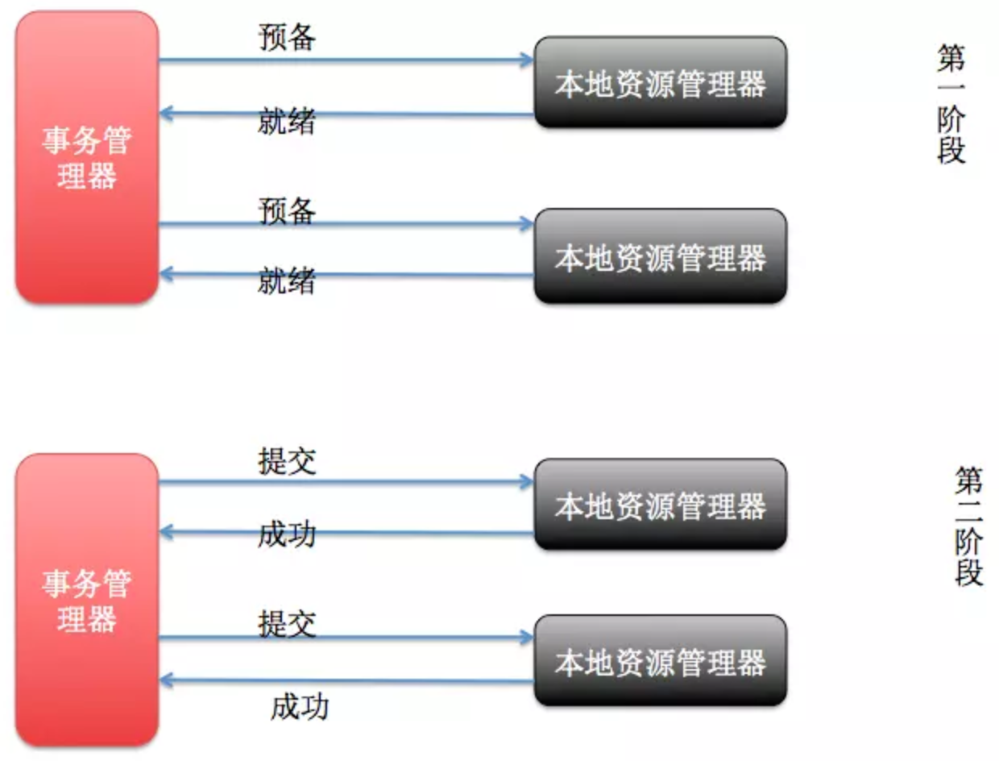

# 分布式事务
### 一、事务的ACID特性
1. 原子性(A)所谓的原子性就是说，在整个事务中的所有操作，要么全部完成，要么全部不做，没有中间状态。对于事务在执行中发生错误，所有的操作都会被回滚，整个事务就像从没被执行过一样。  
2. 一致性(C)事务的执行必须保证系统的一致性  
3. 隔离性(I)所谓的隔离性就是说，事务与事务之间不会互相影响，一个事务的中间状态不会被其他事务感知。  
4. 持久性(D)所谓的持久性，就是说一单事务完成了，那么事务对数据所做的变更就完全保存在了数据库中，即使发生停电，系统宕机也是如此。  

### 二、分布式事务的应用场景
1. 支付最经典的场景就是支付了，一笔支付，是对买家账户进行扣款，同时对卖家账户进行加钱，这些操作必须在一个事务里执行，要么全部成功，要么全部失败。而对于买家账户属于买家中心，对应的是买家数据库，而卖家账户属于卖家中心，对应的是卖家数据库，对不同数据库的操作必然需要引入分布式事务。  
2. 在线下单买家在电商平台下单，往往会涉及到两个动作，一个是扣库存，第二个是更新订单状态，库存和订单一般属于不同的数据库，需要使用分布式事务保证数据一致性。  

### 三、常见的分布式事务解决方案
1. 基于XA协议的两阶段提交  

2. 消息事务 + 最终一致性(微信/支付宝支付)  

3. TCC编程模式  
所谓的TCC编程模式，也是两阶段提交的一个变种。TCC提供了一个编程框架，将整个业务逻辑分为三块：Try、Confirm和Cancel三个操作。

