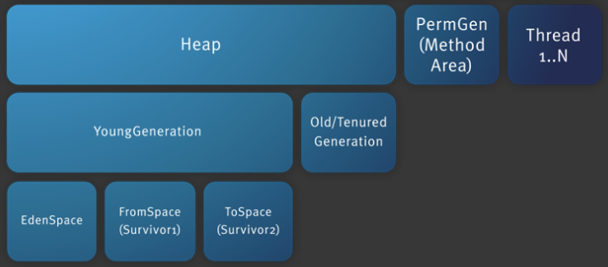
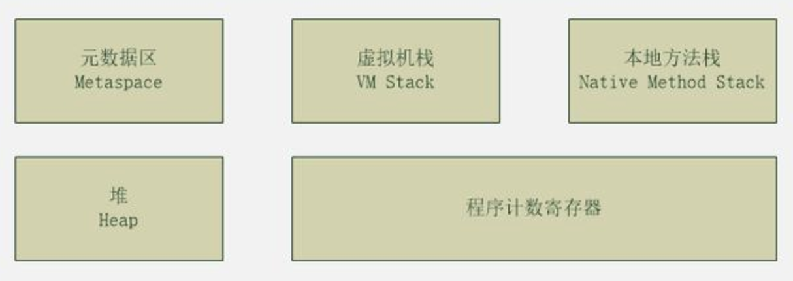
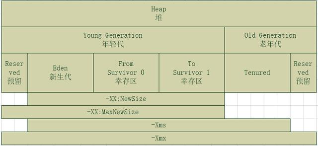
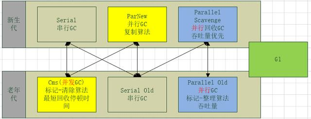

# jvm jdk7



>JVM内存结构主要有三大块：堆内存、方法区和栈。
1. 堆内存由年轻代和老年代组成，年轻代内存又被分成三部分，Eden空间、From Survivor空间、To Survivor空间。年轻代默认分配比例8:1:1
2. 方法区存储类信息、常量、静态变量等数据，是线程共享的区域，Non-Heap(非堆)
3. 栈分为java虚拟机栈和本地方法栈，主要用于方法的执行

> 控制参数
- -Xms设置堆的最小空间大小。
- -Xmx设置堆的最大空间大小。
- -XX:NewSize设置新生代最小空间大小。
- -XX:MaxNewSize设置新生代最大空间大小。
- -XX:PermSize设置永久代最小空间大小。
- -XX:MaxPermSize设置永久代最大空间大小。
- -Xss设置每个线程的堆栈大小。
> 老年代空间大小=堆空间大小-年轻代大空间大小


### 一、Java堆(Heap)
- 线程共享，整个Java虚拟机只有一个堆，所有的线程都访问同一个堆。而程序计数器、Java虚拟机栈、本地方法栈都是一个线程对应一个。
- 在虚拟机启动时创建。
- 是垃圾回收的主要场所。
- 新生代(Eden区，From Survior和To Survivor)、老年代。

### 二、方法区(Method Area)
- 被虚拟机加载的类信息
- 常量
- 静态变量
- 即时编译器编译后的代码

> 特点
- 线程共享
- 持久代
- 内存回收效率低
- Java虚拟机规范对方法区的要求比较宽松

### 三、程序计数器(Program Counter Register)
- 是一块较小的内存空间。
- 线程私有，每条线程都有自己的程序计数器。
- 生命周期：随着线程的创建而创建，随着线程的结束而销毁。
- 唯一一个不会出现OutOfMemoryError的内存区域。

### 四、JVM栈(JVM Stacks)
描述Java方法运行过程的内存模型。

> 特点
- 局部变量表随着栈帧的创建而创建，它的大小在编译时确定，创建时只需分配事先规定的大小即可。在方法运行过程中，局部变量表的大小不会发生改变。
- Java虚拟机栈会出现两种异常：StackOverFlowError和OutOfMemoryError。
- Java虚拟机栈是线程私有，随着线程创建而创建，随着线程的结束而销毁。

### 五、本地方法栈(Native Method Stacks)
>本地方法栈是为JVM运行Native方法准备的空间，它与Java虚拟机栈实现的功能类似，只不过本地方法栈是描述本地方法运行过程的内存模型。


# jvm jdk8




> 元数据区内存不在JVM中，而是使用的本地内存，默认情况下受操作系统内存限制。调整元数据区内存大小的参数 -XX:MetaspaceSize -XX:MaxMetaspaceSize

> -Xms和-Xmx用于设置堆内存的大小

> -XX:NewSize和-XX:MaxNewSize用于设置年轻代的大小，建议设为整个堆大小的1/3或者1/4，两个值设为一样大。

> -XX:SurvivorRatio用于设置Eden和其中一个Survivor的比值

> -XX:NewRatio=3代表新生代和老年代的比例为1:3

https://juejin.im/entry/5aa5d7746fb9a028cd44ba82
# gc


> GC主要分新生代GC和老年代GC
1. 新生代GC：串行GC、并行GC、并行回收GC
2. 老年代GC：串行GC、并行GC、CMS    

> G1比较特殊，同时支持新生代和老年代

> GC在选择上，主要关注两点，吞吐量优先和暂停时间优先，
1. 吞吐量优先  
采用server默认的并行GC(Parallel GC)方式(蓝色区域)
2. 暂停时间优先  
选用并发GC(CMS)方式(黄色区域)，常用场景：互联网、电商类

> 常用GC开启方式
```text
1. 暂停时间优先: 并行GC+CMS
开启方式[ -XX:+UseConcMarkSweepGC -XX:+UseParNewGC ]

2. 吞吐量优先: 并行回收GC + 并行GC
开启方式 [ -XX:+UseParallelOldGC ]，server模式默认的配置

3. G1: [ -XX:+UseG1GC ]
适用于服务器端、大内存、多CPU情景的垃圾收集器
G1的目标是在维持高效率回收的同时，提供软实时中断特性
常用场景：hadoop、elasticsearch
```

> CMS(Concurrent Mark Sweep)收集器是一种以获取最短回收停顿时间为目标的收集器。
- 初始标记（CMS initial mark）
- 并发标记（CMS concurrent mark）
- 重新标记（CMS remark）
- 并发清除（CMS concurrent sweep）

> CMS和G1区别
```text


CMS堆 -> 年轻代老年代
G1堆 -> 多个区 -> 每个区里(年轻代老年代)
Cms 标记清理算法

G1 压缩复制算法，不产生碎片
G1 时间停顿可设置，相关参数[ -XX:MaxGCPauseMillis=100 -XX:GCPauseIntervalMillis=200 ]
```
