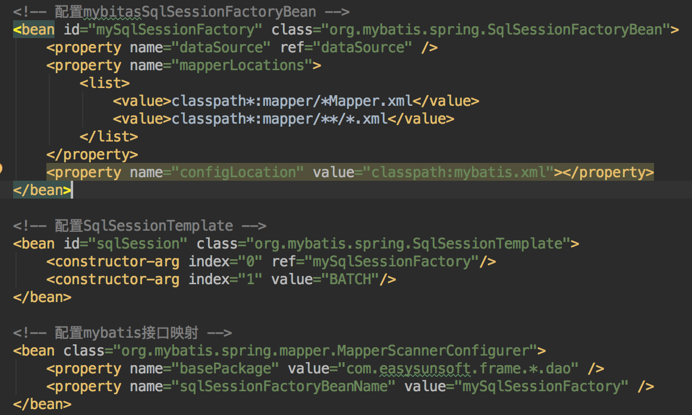
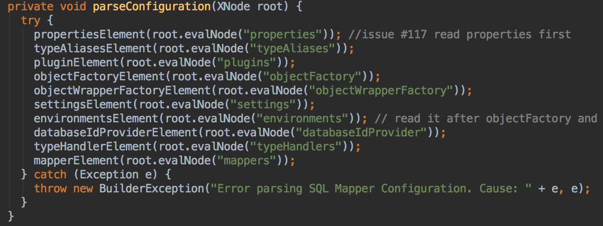
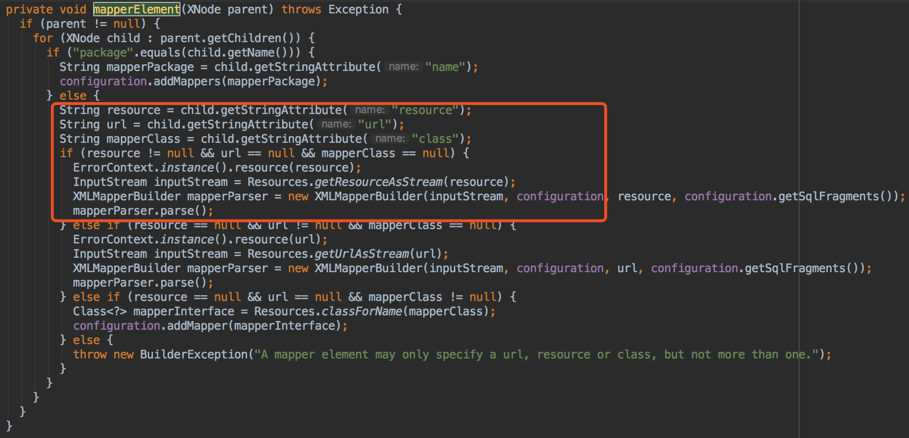
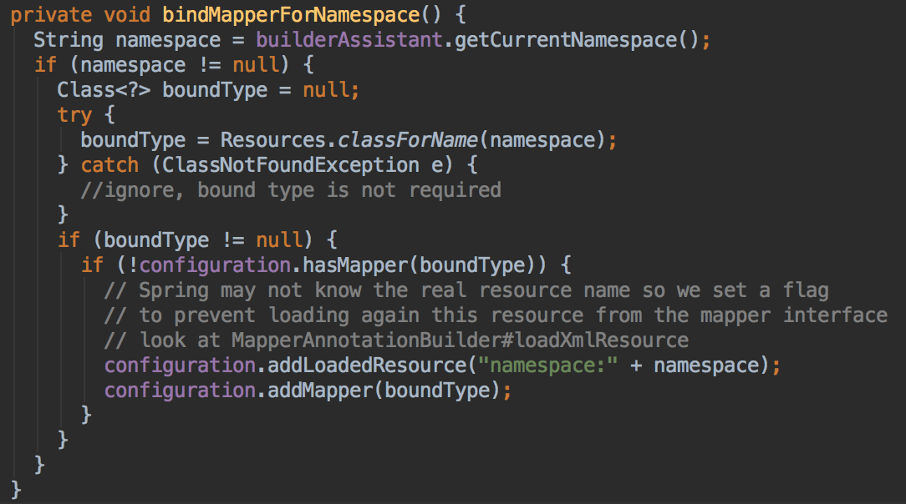
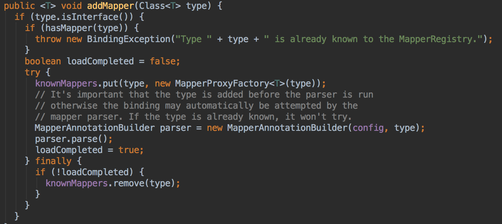
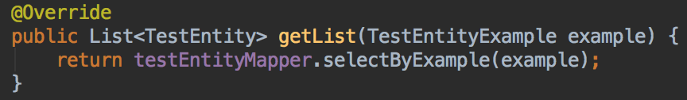

# mybatis
### mybatis初始化流程
1. 通过mybatis-spring包中SqlSessionFactoryBean从xml中读取相关配置

2. SqlSessionFactoryBean.buildSqlSessionFactory方法构建mybatis的SqlSessionFactory

3. 通过configLocation拿到mybatis的xml配置文件，并解析配置信息
    1. new XMLConfigBuilder(this.configLocation.getInputStream(), null, this.configurationProperties);构建XMLConfigBuilder，并为configuration = xmlConfigBuilder.getConfiguration();赋值
    2. configuration配置检查等，例参数设置、类型别名、mybatis插件及mapper.xml检验等

4. 通过sqlSessionFactoryBuilder.build(configuration);创建SqlSessionFactory

5. mybatis先构建XMLConfigBuilder parser = new XMLConfigBuilder(inputStream, environment, properties);

6. build(parser.parse())先解析mybatis配置文件，完成SqlSessionFactory的创建

7. mapperElement(root.evalNode("mappers"));解析mapper.xml文件，并根据xml配置信息创建XMLMapperBuilder

8. bindMapperForNamespace();通过xml中的namespace反射生成java类，通过configuration.addMapper(boundType);添加到MapperRegistry中

9. knownMappers.put(type, new MapperProxyFactory<T>(type));构建DAO实现Bean的代理(MapperProxyFactory作用根据bean名称去获取该类中的所有方法，再通过代理生成DAO实现类)

### DAO调用执行过程

1. 当testEntityMapper调用selectByExample方法时，实际上已经知道了bean名称TestEntityMapper
2. mybatis会从configuration先获取到mapperRegistry，再通过mapperRegistry去hashmap中去查找该bean
3. 查找到该bean(实际上是MapperProxy代理类)后，执行invoke方法，就会执行调用的具体方法
