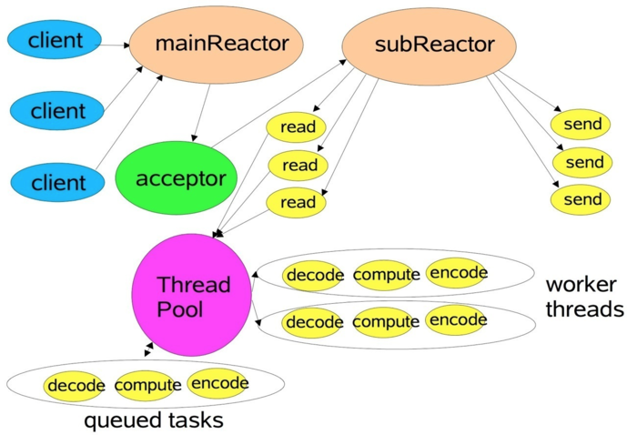

# netty version 4
### netty server架构
Netty中使用的多Reactor模式，即一个主Reactor负责监控所有的连接请求，多个子Reactor负责监控并处理读/写请求，减轻了主Reactor的压力，降低了主Reactor压力太大而造成的延迟。
每个子Reactor分别属于一个独立的线程，每个成功连接后的Channel的所有操作由同一个线程处理。这样保证了同一请求的所有状态和上下文在同一个线程中，避免了不必要的上下文切换，同时也方便了监控请求响应状态。



### netty server
ServerBootstrap-->设置boss和worker线程-->设置channel(nio设置为NioServerSocketChannel.class，创建ChannelFactory负责创建channel)-->设置用户回调handler-->设置Netty连接参数信息(tcp参数)-->bootstrap.bind(ip, port)绑定端口
1. ServerBootstrap参数设置
2. bind端口
3. 创建netty channel，并创建DefaultChannelPipeline，此类包含head(ChannelInboundHandler)和tail(ChannelOutboundHandler)两个链表，维护DefaultChannelHandlerContext，此类中inbound和outbound尤为重要，在获取handler时用到此值判断，链表循环查找
final Channel channel = channelFactory().newChannel();
4. 初始化channel，调用ServerBootstrap.init()方法，设置options，添加handlers到ChannelPipeline中
init(channel);
5. 向boss线程池中注册通道
ChannelFuture regFuture = group().register(channel);
注册实际处理方法是SingleThreadEventLoop.register方法中的channel.unsafe().register(this, promise)这一行，
SingleThreadEventLoop.register()-->channel.unsafe().register(this, promise)-->AbstractUnsafe.register()-->register0(promise)-->doRegister()-->AbstractNioChannel.doRegister()-->
for (;;) {
    selectionKey = javaChannel().register(eventLoop().selector, 0, this);
}
6. 注册执行结束后
1) 注册成功执行
   // 创建ChannelPromise
    promise = channel.newPromise();
    doBind0(regFuture, channel, localAddress, promise);
    // channel绑定并添加到监听
    channel.bind(localAddress, promise).addListener(ChannelFutureListener.CLOSE_ON_FAILURE);
    // 将链表中的所有回调都绑定到通道上
    pipeline.bind(localAddress, promise);
2) 注册失败执行
   promise = new DefaultChannelPromise(channel, GlobalEventExecutor.INSTANCE);
   regFuture.addListener(new ChannelFutureListener() {
       @Override
       public void operationComplete(ChannelFuture future) throws Exception {
           doBind0(regFuture, channel, localAddress, promise);
       }
   });
7. 完成绑定，netty server启动完成

### netty client
1. 创建Bootstrap实例(new Bootstrap())
2. 设置NioEventLoopGroup(创建线程池)
3. 指定Channel类型(NioSocketChannel)
4. option配置
5. 指定Handler
6. connect(String inetHost, int inetPort)，同ServerBootstrap的doBind方法
7. 完成连接，netty client启动完成

### netty "Zero Copy"
```java
CompositeByteBuf类(组合方式零拷贝)
CompositeByteBuf compositeByteBuf = Unpooled.compositeBuffer(size);
compositeByteBuf.addComponent(byteBuf1); 
compositeByteBuf.addComponent(byteBuf2); 
compositeByteBuf.addComponent(byteBuf3);

ByteBufAllocator类(池化内存)
ByteBuf buffer = ByteBufAllocator.DEFAULT.buffer(); 
ByteBuf buffer = ByteBufAllocator.DEFAULT.heapBuffer(); 
ByteBuf buffer = ByteBufAllocator.DEFAULT.ioBuffer(); 
ByteBuf buffer = ByteBufAllocator.DEFAULT.directBuffer(); 
ByteBuf buffer = ByteBufAllocator.DEFAULT.compositeBuffer();

Unpooled类(可以分配新内存或对内存进行包装)
ByteBuf heapBuffer = Unpooled.buffer(128); 
ByteBuf directBuffer = Unpooled.directBuffer(256); 
ByteBuf wrappedBuffer = Unpooled.wrappedBuffer(new byte[128], new byte[256]); 
ByteBuf copiedBuffe r = Unpooled.copiedBuffer(ByteBuffer.allocate(128));

DefaultFileRegion类(文件零拷贝)
RandomAccessFile raf = new RandomAccessFile(msg, "r");
int length = raf.length();
ctx.write(new DefaultFileRegion(raf.getChannel(), 0, length));
```