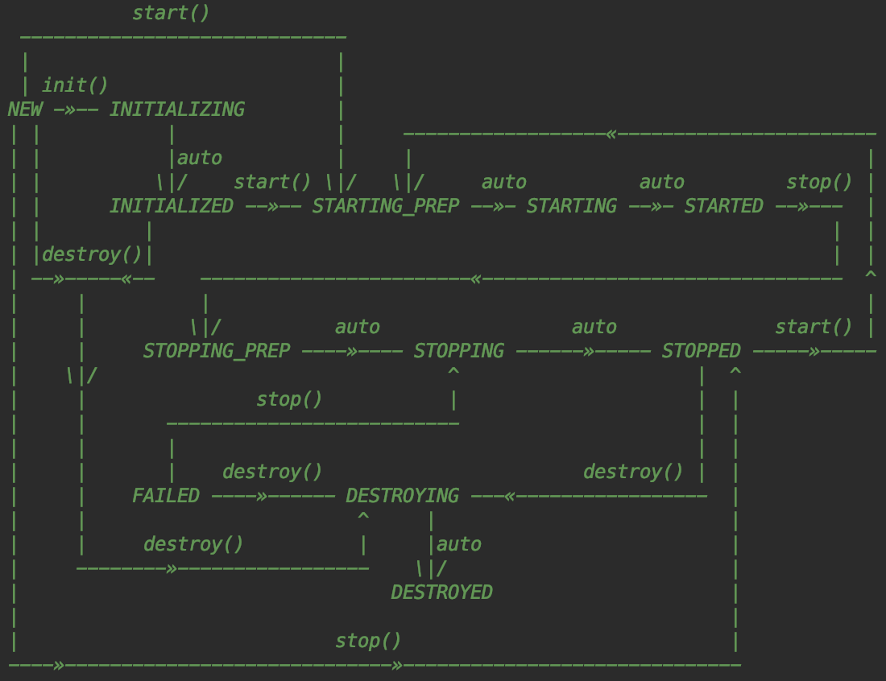

# [tomcat version 9.0.12](http://tomcat.apache.org/tomcat-9.0-doc/index.html)
## tomcat 架构体系




## Tomcat
### 1. shell 调用关系
> $ start_up.sh -> catalina.sh
    
    ```bash
    # start_up.sh
    # $@ 获取参数列表
    exec "$PRGDIR"/"$EXECUTABLE" start "$@"
    
    # catalina.sh
    eval \{ $_NOHUP "\"$_RUNJAVA\"" "\"$LOGGING_CONFIG\"" $LOGGING_MANAGER $JAVA_OPTS $CATALINA_OPTS \
          -D$ENDORSED_PROP="\"$JAVA_ENDORSED_DIRS\"" \
          -classpath "\"$CLASSPATH\"" \
          -Dcatalina.base="\"$CATALINA_BASE\"" \
          -Dcatalina.home="\"$CATALINA_HOME\"" \
          -Djava.io.tmpdir="\"$CATALINA_TMPDIR\"" \
          org.apache.catalina.startup.Bootstrap "$@" start \
          2\>\&1 \&\& echo \$! \>\"$catalina_pid_file\" \; \} $catalina_out_command "&"
    ```
    
### 2. tomcat 源码分析
1. [Bootstrap](./startup/Bootstrap.java)
    1. Bootstrap#main()
    2. static 代码块(初始化 tomcat 运行环境)
    3. new Bootstrap()
    4. Bootstrap#init()
    5. 设置 Catalina#setAwait(true)，用于阻塞 main 线程
    6. Bootstrap#load()，通过反射实例化 Catalina，调用 Catalina.load(String args[])
    7. Bootstrap#start()，调用 Catalina#start()
2. [Catalina](./startup/Catalina.java)
    1. Catalina.load(String args[]) -> Catalina#setParentClassLoader()
    2. 初始化 java.io.tmpdir 目录
    3. 初始化 java 命名服务
    4. 加载 tomcat 配置文件
    5. 将 conf/server.xml 解析为 StandardServer
    6. StandardServer#init() -> StandardServer#initInternal()
3. [StandardServer](./core/StandardServer.java)   
    1. StandardServer#initInternal()
    2. 创建 [MBeanServer](../../../javax/management/MBeanServer.java)
    3. [StandardService](./core/StandardService.java)
        1. StandardService#initInternal()
        2. StandardEngine#initInternal()
        3. [MapperListener](./mapper/MapperListener.java) -> MapperListener#init()(调用LifecycleBase#)
        4. Connector("HTTP/1.1) 8080 -> Connector#initInternal()
        5. Connector("AJP/1.3) 8009 -> Connector#initInternal()
    4. [StandardEngine](./core/StandardEngine.java)
        1. StandardEngine#initInternal()
        2. 初始化 Realm
        3. 初始化线程池
    5. [Connector](./connector/Connector.java "用于处理 http 请求")
        1. Connector#initInternal()
        2. 设置 [ProtocolHandler](../coyote/ProtocolHandler.java) 回调，处理 request 请求
        3. 设置 HTTP 解析方法
        4. AbstractHttp11Protocol#init() -> AbstractProtocol#init()
        5. AbstractEndpoint#init()
4. tomcat start(调用 [Lifecycle](Lifecycle.java) 实现类 1. startInternal() 2. start())
    1. Catalina#start()
    2. StandardServer#startInternal()
    3. NamingResourcesImpl#startInternal()
    4. StandardService#startInternal()
    5. StandardEngine#startInternal() -> ContainerBase#startInternal() -> LockOutRealm#startInternal() -> CombinedRealm#startInternal()
        -> UserDatabaseRealm#startInternal() -> RealmBase#startInternal() -> HostConfig#beforeStart() -> StandardHost#startInternal()
        -> StandardPipeline#startInternal() -> ValveBase#startInternal() -> HostConfig#start()[deployApps->deployDescriptors->deployWARs->deployDirectories] -> NioEndpoint#startInternal()
        -> StandardPipeline#start() -> StandardEngineValue#start() -> ContainerBase#threadStart()(守护线程) ->  MapperListener#startInternal()
        -> MapperListener#registerHost() -> StandardService#start() -> Connector#startInternal()(8080/8009) -> ProtocolHandler.start() -> AbstractProtocol#start()(守护线程)
        -> 添加钩子回调 -> halt main 线程 -> tomcat 启动完成
    
### 3. 启动 tomcat
1. 拷贝目录 tomcat/conf 与 tomcat/webapps 到 learning 目录下
2. 启动 [Bootstrap](./startup/Bootstrap.java) main() 方法
3. [web ui](http://localhost:8080/)

### 4. tomcat 处理 http 请求流程
1. [Acceptor](../tomcat/util/net/Acceptor.java)
    1. http 请求处理入口为 Acceptor#run() 方法
    2. serverSocketAccept() 获取 SocketChannel
    3. NioEndpoint#setSocketOptions() 设置 Socket 连接配置
2. [NioEndpoint](../tomcat/util/net/NioEndpoint.java)
    1. 获取 [NioChannel](../tomcat/util/net/NioChannel.java)
    2. [Poller](../tomcat/util/net/NioEndpoint.java#Poller)#register(channel) 注册 NioChannel
        1. 创建 [NioSocketWrapper](../tomcat/util/net/NioEndpoint.java#NioSocketWrapper)，即 tomcat worker 线程
        2. 添加 [PollerEvent](../tomcat/util/net/NioEndpoint.java#PollerEvent) 事件，用于 Poller 线程事件流转
        3. Poller#run()
        4. PollerEvent#run()
        5. Poller#processKey(SelectionKey, NioSocketWrapper)
        6. [AbstractEndpoint](../tomcat/util/net/AbstractEndpoint.java)#processSocket(SocketWrapperBase, SocketEvent, boolean)
        7. 创建 [SocketProcessor](../tomcat/util/net/NioEndpoint.java#SocketProcessor) new SocketProcessor(socketWrapper, event)
3. SocketProcessor#doRun()(SocketProcessorBase#run()调用)
    1. TCP 握手
    2. getHandler().process(socketWrapper, event)， getHandler() -> AbstractProtocol 子类
    3. [AbstractProtocol](../coyote/AbstractProtocol.java#ConnectionHandler)#process(SocketWrapperBase, SocketEvent)
6. [AbstractProcessorLight](../coyote/AbstractProcessorLight.java)#process(SocketWrapperBase, SocketEvent)
    1. [AbstractProcessor](../coyote/AbstractProcessor.java)#dispatch(SocketEvent status)
    2. Http11Processor#service(SocketWrapperBase)
7. [Http11Processor](../coyote/http11/Http11Processor.java)#service(SocketWrapperBase)
    1. [Http11InputBuffer](../coyote/http11/Http11InputBuffer.java)#parseRequestLine(boolean, int, int) 解析 http request header
    2. CoyoteAdapter#service(Request, Response)
8. [CoyoteAdapter](./connector/CoyoteAdapter.java)#service(Request, Response)
    1. connector.getService().getContainer().getPipeline().getFirst().invoke(Request, Response)
    2. Connector->StandardService->StandardEngine->StandardPipeline->Valve.invoke(Request, Response)
    3. Valve 实现类调用顺序(责任链设计模式)
        1. [StandardEngineValve](./core/StandardEngineValve.java)#invoke(Request, Response)
        2. [StandardHostValve](./core/StandardHostValve.java)#invoke(Request, Response)
        3. [StandardContextValve](./core/StandardContextValve.java)#invoke(Request, Response)
        4. [StandardWrapperValve](./core/StandardWrapperValve.java)#invoke(Request, Response)
    4. [ApplicationFilterFactory](./core/ApplicationFilterFactory.java)#createFilterChain(request, wrapper, servlet);
    5. [ApplicationFilterChain](./core/ApplicationFilterChain.java)#doFilter(ServletRequest, ServletResponse)
    6. ApplicationFilterChain#internalDoFilter(ServletRequest, ServletResponse)

## Tomcat Modules
###  一、 Connector
#### 1. connector
1. Http Connector：解析HTTP请求，又分为BIO Http Connector和NIO Http Connector，即阻塞IO Connector和非阻塞IO Connector。本文主要分析NIO Http Connector的实现过程。
2. AJP：基于AJP协议，用于Tomcat与HTTP服务器通信定制的协议，能提供较高的通信速度和效率。如与Apache服务器集成时，采用这个协议。
3. APR HTTP Connector：用C实现，通过JNI调用的。主要提升对静态资源（如HTML、图片、CSS、JS等）的访问性能。

#### 2. [tomcat nio thread](../tomcat/util/net/NioEndpoint.java)
> NIO tailored thread pool, providing the following services
1. Socket acceptor thread([Acceptor](../tomcat/util/net/Acceptor.java))
2. Socket poller thread([NioEndpoint.Poller](../tomcat/util/net/NioEndpoint.java#Poller))
3. Worker threads pool([NioEndpoint.SocketProcessor](../tomcat/util/net/NioEndpoint.java#SocketProcessor))

### 二、 Container
1. Engine: 整个Catalina servlet引擎的表示，最有可能包含一个或多个主机或上下文实现的子容器，或其他自定义组。
2. Host: 表示包含多个上下文的虚拟主机。
3. Context: 表示单个ServletContext，它通常包含一个或多个支持的servlet的Wrappers。
4. Wrapper: 表示单个servlet定义(如果servlet本身实现SingleThreadModel，则可以支持多个servlet实例)。

### 三、 JNDI(Java naming and directory interface(Java命名和目录接口))
1. JNDI 目的是为了解藕，为了开发更加容易维护，容易扩展，容易部署的应用。 
2. JNDI 是一个sun提出的一个 J2EE 规范，具体的实现是各个 J2EE 容器提供商，sun 要求 J2EE 容器必须有 JNDI 功能。 
3. JNDI 在 J2EE 系统中的角色是交换机，是 J2EE 组件在运行时间接地查找其他组件、资源或服务的通用机制。 
4. JNDI 是通过资源的名字来查找的，资源的名字在整个 J2EE 应用/容器中是唯一的。 
